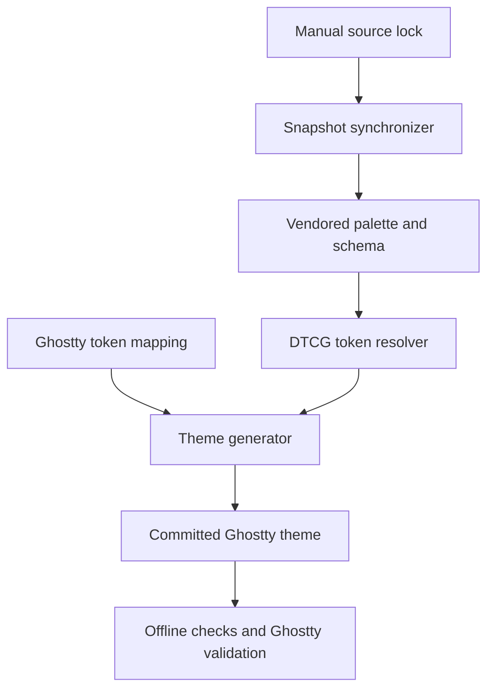
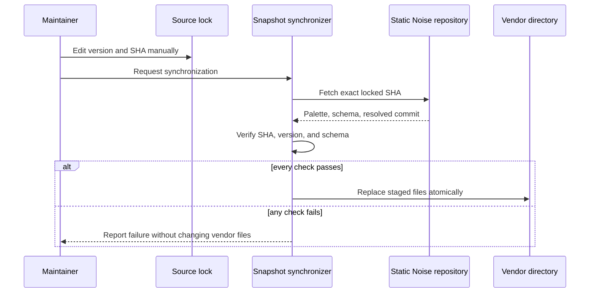

# Static Noise Ghostty Adapter - Plan

## Goal Capsule

- **Objective:** Ghostty users can install a theme that preserves the visual semantics of a known Static Noise release and can trace the generated colors to their exact upstream source.
- **Means:** Build a deterministic adapter that reads a manually maintained source lock, vendors the pinned Static Noise palette, resolves its tokens, and emits a committed Ghostty theme. (KTD1-KTD5)
- **Authority:** Product Requirements and session-settled decisions override planning choices; `static-noise.lock.json` selects the upstream source; the vendored snapshot is the only input to offline generation.
- **Execution profile:** Standard software plan; implementation proceeds in U-ID dependency order.
- **Stop conditions:** Stop rather than publish output when the lock is invalid, the fetched commit differs from the locked SHA, the palette version differs from the lock, a required token cannot resolve, generated output is stale, or Ghostty rejects the theme.
- **Completion owner:** The implementing agent completes the units and verification gates; the maintainer reviews the generated diff and publishes the repository release.

---

## Product Contract

### Summary

Create a reproducible Static Noise adapter for Ghostty 1.3 or newer. The repository will pin an upstream release manually, keep an unmodified local snapshot, generate a ready-to-install theme, and document every direct or Ghostty-specific mapping.

### Problem Frame

Static Noise publishes a token contract rather than configurations for individual tools. Ghostty users therefore cannot adopt the identity without manually translating surfaces, content, focus, selection, and ANSI colors. A handwritten theme would be easy to install but difficult to prove correct or update safely when the upstream contract changes.

The adapter must preserve the separation established by Static Noise: the upstream repository owns shared visual intent, while this repository owns Ghostty representation, compatibility, tests, and releases.

### Key Decisions

- **Generate the theme from a pinned snapshot.** (session-settled: user-directed — chosen over a hand-maintained theme or a full installation product: snapshot-driven generation preserves the source identity without expanding the first release into installation tooling.) Governs R1-R9.
- **Derive and document Ghostty-specific colors.** (session-settled: user-directed — chosen over omitting unsupported roles: search and split UI should remain visually coherent with Static Noise.) Governs R8-R10.
- **Keep the source lock manual and minimal.** (session-settled: user-directed — chosen over a script-managed lock and an additional palette checksum: `repository`, `version`, and immutable `sha` are the explicit source of truth.) Governs R1-R5.

### Requirements

**Source pinning and snapshot**

- R1. `static-noise.lock.json` contains exactly the upstream `repository`, semantic `version`, and immutable commit `sha` used by the adapter.
- R2. Maintainers update the lock manually; repository tooling may read it but must never rewrite it.
- R3. Snapshot synchronization retrieves files from the locked repository at the exact SHA and rejects a different resolved commit.
- R4. Synchronization rejects a palette whose declared version differs from the lock version.
- R5. The vendored palette and schema remain byte-for-byte upstream inputs rather than locations for Ghostty-specific corrections.

**Token conversion and Ghostty output**

- R6. Generation resolves direct colors and nested DTCG references, and fails on missing, malformed, or circular references.
- R7. Core Ghostty fields map by intent from Static Noise semantic roles; ANSI indices 0-15 map from `projections.ansi`.
- R8. Ghostty-only fields use documented local mappings from existing Static Noise roles or primitives, with no arbitrary hexadecimal colors in mapping code.
- R9. Generation produces a deterministic, committed `dist/Static Noise` theme that identifies the source version and SHA in comments.
- R10. The theme configures the 16 ANSI colors and enables Ghostty's extended-palette generation so colors 16-255 remain coherent with Static Noise.

**Verification and distribution**

- R11. Offline tests detect invalid locks, declared version drift between lock and snapshot, schema invalidity, unresolved tokens, incomplete mappings, stale output, and insufficient contrast for explicit foreground/background pairs. Commit SHA drift detection belongs to explicit snapshot synchronization.
- R12. The official Ghostty validator accepts the generated theme on the documented minimum supported Ghostty version.
- R13. CI runs the offline suite, generated-output check, and Ghostty validation on every proposed change.
- R14. Documentation explains installation, mapping rationale, and the manual lock-edit/snapshot-sync workflow without providing an automatic lock updater.

### Acceptance Examples

- AE1. **Manual source update**
  - **Covers:** R1-R5, R9
  - **Given:** A maintainer manually changes `version` and `sha` to a valid Static Noise release.
  - **When:** The maintainer synchronizes the snapshot and regenerates the theme.
  - **Then:** The vendored inputs and generated theme update together, while the lock remains byte-identical to the maintainer's edit.

- AE2. **Unreachable or mismatched source**
  - **Covers:** R2-R5
  - **Given:** The lock names an unreachable SHA, a different repository commit, or a palette with a different version.
  - **When:** Snapshot synchronization runs.
  - **Then:** It exits with a specific failure and leaves the existing lock and vendored snapshot unchanged.

- AE3. **Unsupported palette contract**
  - **Covers:** R6-R9, R11
  - **Given:** A required token is absent, malformed, or circular in the vendored snapshot.
  - **When:** Theme generation runs.
  - **Then:** No new distributable theme is accepted, and the failing token path is reported.

- AE4. **End-user installation**
  - **Covers:** R9-R14
  - **Given:** A Ghostty 1.3+ user copies `dist/Static Noise` into the user themes directory and selects `theme = Static Noise`.
  - **When:** Ghostty loads or validates the configuration.
  - **Then:** The theme is accepted and applies Static Noise background, foreground, cursor, selection, search, split-divider, and ANSI colors.

### Success Criteria

- A fresh checkout can reproduce `dist/Static Noise` from the committed snapshot without network access or output differences.
- The generated theme passes `ghostty +validate-config` on Ghostty 1.3 or newer.
- Explicit text pairs used by the adapter meet at least 4.5:1 contrast; structural boundaries that claim strong visibility meet at least 3:1 against their target surface.
- A Static Noise update appears as one reviewable change containing the manual lock edit, upstream snapshot diff, regenerated theme, and any required mapping or documentation changes.

### Scope Boundaries

**Included**

- Dark Static Noise theme generation for Ghostty 1.3+.
- A manual source lock, explicit snapshot synchronization, deterministic generation, tests, documentation, and CI.
- Documented local derivations for Ghostty search and split-divider colors.

#### Deferred to Follow-Up Work

- A light Static Noise variant, if the upstream contract publishes one.
- Submission to Ghostty's bundled theme collection or third-party theme registries.
- Release automation beyond verification of the repository contents.

**Outside this product's identity**

- An installer, uninstaller, or user configuration editor.
- Automatic modification of `static-noise.lock.json`.
- Runtime network access during theme generation, tests, or normal use.
- Theme settings unrelated to color identity, including fonts, opacity, cursor shape, shell integration, and window behavior.

### Dependencies

- Static Noise repository and release `0.0.1` at SHA `3a1440055e1c87aec61ac885f137aad7f816d3ec`.
- Node.js 24 or newer, matching the upstream Static Noise runtime baseline.
- Git for synchronization from the locked repository and SHA.
- Ghostty 1.3 or newer for extended-palette generation and official config validation.

---

## Planning Contract

### Key Technical Decisions

- KTD1. **Treat `static-noise.lock.json` as a read-only input to tooling.** The parser accepts only `repository`, `version`, and a full lowercase 40-character `sha`; synchronization tests prove that the file is never rewritten. (session-settled: user-directed — chosen over a script-managed lock and an additional checksum: the user wants manual, explicit source control.) Implements R1-R4.
- KTD2. **Fetch the exact commit through Git in a temporary workspace.** Synchronization uses the repository URL and SHA directly, verifies the resolved commit, stages `palette.json` and `schemas/palette.schema.json`, validates both, and replaces the vendor files only after every check passes. This avoids coupling the lock format to GitHub raw-content URL conventions. Implements R3-R5.
- KTD3. **Keep synchronization separate from generation.** Network access is confined to the explicit snapshot-sync command; the generator and all normal tests consume only committed vendor files. Implements R2, R5, R9, R11.
- KTD4. **Represent the mapping as token paths rather than resolved colors.** The resolver owns DTCG traversal, while the Ghostty mapping names semantic or domain tokens and documents each local primitive fallback. This makes upstream contract changes fail visibly instead of silently preserving stale hexadecimal values. Implements R6-R8.
- KTD5. **Commit the generated Ghostty theme and verify it by regeneration.** Users install the distributable directly, while CI renders the expected output in isolation and compares bytes to detect hand edits or stale generation. Implements R9-R13.
- KTD6. **Target Ghostty 1.3+ and enable `palette-generate`.** The adapter defines ANSI 0-15 from Static Noise and delegates 16-255 to Ghostty's supported extended-palette generation instead of inheriting unrelated defaults. Implements R10, R12.
- KTD7. **Use Static Noise roles for Ghostty-local UI.** The split divider uses `semantic.outline.strong`; normal search uses `primitives.accentDim.yellow` (`search-background`) with `semantic.content.primary` (`search-foreground`); selected search uses focus/on-focus. These mappings remain in adapter documentation rather than extending the upstream token contract. Implements R8, R11.

### High-Level Technical Design

The adapter has two separate paths: an explicit networked synchronization path and an offline generation path.



Snapshot replacement is transactional: validation finishes before committed vendor files change.



### Output Structure

```text
.
├── .github/
│   └── workflows/
│       └── verify.yml
├── docs/
│   ├── mapping.md
│   └── updating.md
├── dist/
│   └── Static Noise
├── scripts/
│   └── sync-palette.mjs
├── src/
│   ├── generate-theme.mjs
│   ├── ghostty-mapping.mjs
│   └── resolve-token.mjs
├── test/
│   ├── fixtures/
│   │   └── palettes/
│   ├── helpers/
│   │   └── colors.mjs
│   ├── contrast.test.mjs
│   ├── generated-theme.test.mjs
│   ├── lock.test.mjs
│   ├── mapping.test.mjs
│   ├── snapshot.test.mjs
│   ├── sync-palette.test.mjs
│   └── token-resolver.test.mjs
├── vendor/
│   └── static-noise/
│       ├── palette.json
│       └── palette.schema.json
├── .gitignore
├── LICENSE
├── README.md
├── package-lock.json
├── package.json
└── static-noise.lock.json
```

### Implementation Constraints

- The lockfile is never generated, normalized, or rewritten by project tooling.
- Mapping source files contain token paths and Ghostty settings, not copied hexadecimal values.
- Vendor files preserve upstream bytes; validation or adaptation happens outside `vendor/`.
- Synchronization writes through a temporary staging area and cannot leave a partially updated snapshot.
- Theme output ordering and comments are stable so reviews show semantic changes rather than formatting churn.
- Tests and generation run without network access; only `sync:palette` may contact the upstream repository.

### Sequencing

U1 establishes the package and source contract. U2 adds the only networked boundary. U3 builds the offline conversion primitives. U4 produces and validates the distributable. U5 documents and enforces the complete workflow in CI.

---

## Implementation Units

### U1. Establish the project and source-lock contract

- **Goal:** Create the Node.js project scaffold and encode the manually maintained upstream source contract.
- **Requirements:** R1, R2, R11.
- **Dependencies:** None.
- **Files:**
  - Create `package.json`
  - Create `package-lock.json`
  - Create `LICENSE`
  - Create `static-noise.lock.json`
  - Modify `.gitignore`
  - Create `test/lock.test.mjs`
- **Approach:**
  1. Configure an ESM package on Node.js 24+ with Vitest and AJV as development dependencies; keep the package private until a package-distribution requirement exists.
  2. Add the agreed three-field lock using Static Noise `0.0.1` and SHA `3a1440055e1c87aec61ac885f137aad7f816d3ec`.
  3. Validate exact keys, value types, semantic-version shape, HTTPS Git repository shape, and full lowercase SHA shape without rewriting the parsed document.
  4. Add npm entry points for tests, snapshot sync, generation, generated-output checking, Ghostty validation, and the aggregate check; no entry point may update the lock.
- **Patterns to follow:** Match the upstream Static Noise ESM, Node.js, Vitest, AJV, and MIT licensing conventions where they apply.
- **Test scenarios:**
  - A lock with the three expected values passes validation and remains byte-identical after the validator reads it.
  - Missing, additional, or mistyped fields fail with the offending field named.
  - A short, uppercase, or non-hexadecimal SHA fails before any synchronization attempt.
  - An invalid repository URL or semantic version fails with no filesystem mutation.
- **Verification:** The package installs reproducibly, the lock contract tests pass, and no update-lock command or checksum field exists.

### U2. Synchronize and validate the pinned upstream snapshot

- **Goal:** Materialize the exact palette and schema selected by the manual lock without risking partial vendor updates.
- **Requirements:** R2-R5, R11; covers AE1 and AE2.
- **Dependencies:** U1.
- **Files:**
  - Create `scripts/sync-palette.mjs`
  - Create `vendor/static-noise/palette.json`
  - Create `vendor/static-noise/palette.schema.json`
  - Create `test/sync-palette.test.mjs`
  - Create `test/snapshot.test.mjs`
  - Create fixtures under `test/fixtures/palettes/`
- **Approach:**
  1. Read and validate the lock before creating network or staging work.
  2. Fetch the locked SHA into an isolated temporary Git workspace and require the resolved commit to equal the lock exactly. If direct fetch by commit SHA is restricted by the remote Git server, fetch `refs/tags/v${lock.version}` to make the commit reachable before checking out and requiring the resolved commit to equal `lock.sha`.
  3. Extract the palette and schema from their upstream paths, parse them, validate the palette against the fetched schema, and require `palette.version` to equal the lock version.
  4. Replace both vendor files only after all checks succeed; failures clean temporary state and preserve the prior snapshot.
  5. Keep the script single-purpose: it synchronizes vendor inputs and does not generate the theme or modify the lock.
- **Execution note:** Prove failure atomicity before testing the happy-path replacement; the primary risk is corrupting a previously valid snapshot.
- **Patterns to follow:** Use Node.js temporary-directory and child-process primitives; keep network and Git operations injectable so tests use local fixture repositories rather than public GitHub.
- **Test scenarios:**
  - Covers AE1. A local fixture repository at the locked SHA replaces both vendor files and leaves the lock unchanged.
  - Covers AE2. An unreachable SHA fails before vendor replacement.
  - Covers AE2. A fetched commit that does not equal the lock SHA fails and preserves existing files.
  - A palette/version mismatch fails and preserves existing files.
  - A schema-invalid palette or missing upstream file fails and preserves existing files.
  - A remote requiring tag-ref fetch before SHA checkout still resolves and validates the locked SHA.
  - A successful synchronization preserves the exact upstream bytes for both files.
- **Verification:** Synchronization against a local fixture proves exact-SHA extraction, fallback tag-ref fetch support, schema/version validation, lock immutability, cleanup, and atomic vendor replacement.

### U3. Resolve tokens and define the Ghostty mapping

- **Goal:** Convert the vendored Static Noise contract into resolved Ghostty color roles without embedding copied colors in adapter code.
- **Requirements:** R6-R8, R10, R11; covers AE3.
- **Dependencies:** U2.
- **Files:**
  - Create `src/resolve-token.mjs`
  - Create `src/ghostty-mapping.mjs`
  - Create `test/token-resolver.test.mjs`
  - Create `test/mapping.test.mjs`
- **Approach:**
  1. Implement generic traversal for direct `#RRGGBB` values and `{dot.separated.token}` references with a visited-reference set.
  2. Report the requested token path and reference chain for missing, malformed, or circular values.
  3. Define core Ghostty mappings from semantic roles: `background` to `semantic.surface.canvas`, `foreground` to `semantic.content.primary`, `cursor-color` to `semantic.interaction.focus`, `cursor-text` to `semantic.interaction.onFocus`, `selection-background` to `semantic.surface.selection`, `selection-foreground` to `semantic.content.primary`, and ANSI 0-15 from the named `projections.ansi` entries.
  4. Define Ghostty-local mappings per KTD7: `split-divider-color` to `semantic.outline.strong`, `search-background` to `primitives.accentDim.yellow`, `search-foreground` to `semantic.content.primary`, `search-selected-background` to `semantic.interaction.focus`, and `search-selected-foreground` to `semantic.interaction.onFocus`. Annotate each entry as direct or locally derived for documentation generation or tests.
  5. Reject missing required tokens instead of falling back to a primitive or hardcoded color.
- **Patterns to follow:** Follow the upstream resolver's recursive reference semantics while keeping adapter validation independent from upstream test helpers.
- **Test scenarios:**
  - A direct color resolves unchanged.
  - Multi-hop semantic and domain references resolve to their final color.
  - Missing references report the missing path.
  - Circular references report the cycle rather than overflowing.
  - Every required Ghostty field and ANSI index 0-15 resolves exactly once.
  - Mapping source exports no hexadecimal color literals.
  - Covers AE3. Removing a required upstream token makes mapping validation fail visibly.
- **Verification:** Resolver and mapping tests prove complete, literal-free conversion from the vendored contract.

### U4. Generate and validate the distributable Ghostty theme

- **Goal:** Produce a stable, installable Ghostty theme and reject stale, invalid, or low-contrast output.
- **Requirements:** R7-R13; covers AE3 and AE4.
- **Dependencies:** U3.
- **Files:**
  - Create `src/generate-theme.mjs`
  - Create `dist/Static Noise`
  - Create `test/generated-theme.test.mjs`
  - Create `test/contrast.test.mjs`
  - Create `test/helpers/colors.mjs`
- **Approach:**
  1. Read lock metadata and the committed snapshot, validate both, resolve the mapping, and render Ghostty config in one stable order.
  2. Add generated-file comments containing source version and SHA without adding a second provenance authority.
  3. Emit exact Ghostty configuration keys: `background`, `foreground`, `cursor-color`, `cursor-text`, `selection-background`, `selection-foreground`, `split-divider-color`, `search-background`, `search-foreground`, `search-selected-background`, `search-selected-foreground`, `palette-generate = true`, and `palette = N=#RRGGBB` for indices 0-15.
  4. Support write mode and a non-mutating check mode that compares expected bytes with `dist/Static Noise`.
  5. Test explicit foreground/background contrast using the same WCAG luminance calculation as the upstream contract, and validate the final file with Ghostty.
- **Execution note:** This unit is mostly generation and packaging; prefer golden-output, validator, and installation smoke proof over broad unit mocking.
- **Patterns to follow:** Follow Ghostty's `key = value` theme syntax and repeated `palette = N=#RRGGBB` convention; preserve the upstream contrast thresholds for strong outlines and explicit text pairs.
- **Test scenarios:**
  - The same lock, snapshot, and mapping produce byte-identical output across repeated runs.
  - Check mode passes for current output and fails after a manual edit without rewriting the file.
  - Output includes every required Ghostty key, exactly 16 base palette entries, and `palette-generate = true`.
  - Output comments match the lock version and SHA.
  - Covers AE3. Invalid token resolution prevents generation from being accepted.
  - Core text, selection, cursor, and search pairs meet 4.5:1; the strong split divider meets 3:1 against the canvas.
  - Covers AE4. Ghostty 1.3+ accepts the generated file via its official config validator.
- **Verification:** Regeneration is clean, contrast tests pass, the committed artifact matches expected bytes, and Ghostty accepts it.

### U5. Document usage and enforce the workflow in CI

- **Goal:** Make installation and future palette updates understandable while requiring every pull request to prove reproducibility and Ghostty compatibility.
- **Requirements:** R12-R14; covers AE1 and AE4.
- **Dependencies:** U1-U4.
- **Files:**
  - Create `README.md`
  - Create `docs/mapping.md`
  - Create `docs/updating.md`
  - Create `.github/workflows/verify.yml`
- **Approach:**
  1. Document the product boundary, supported Ghostty version, installation path, theme selection, local generation, and verification commands.
  2. Publish a mapping table that distinguishes direct semantic/domain mappings from Ghostty-local derivations and explains KTD7.
  3. Document the update workflow as manual lock editing followed by snapshot sync, theme generation, checks, and human diff review; state that no tool updates the lock.
  4. Configure CI to run on `macos-14`, install the Node.js baseline, provision Ghostty via `brew install --cask ghostty`, run the offline suite and stale-output check, and validate `dist/Static Noise` using `/Applications/Ghostty.app/Contents/MacOS/ghostty +validate-config`.
  5. Keep snapshot synchronization out of routine CI so verification never changes the selected upstream source.
- **Execution note:** Verify the documented copy-and-load path in a real Ghostty installation before treating prose review as sufficient.
- **Patterns to follow:** Use the terminology from Static Noise's consumer guide and Ghostty's official theme documentation.
- **Test scenarios:**
  - The documented installation copies the committed theme to Ghostty's user theme directory and the named theme resolves.
  - The documented update sequence never invokes a lock-writing command.
  - CI fails for unit-test failures, stale generated output, or Ghostty validation failure.
  - CI performs no snapshot synchronization and leaves the working tree unchanged.
- **Verification:** A contributor can follow the README from a clean checkout, and the CI workflow enforces every command in the Verification Contract.

---

## Verification Contract

| Gate | Command | Applies to | Required outcome |
|---|---|---|---|
| Unit and contract tests | `npm test` | U1-U4 | Lock, sync, resolver, mapping, generation, and contrast suites pass without network access. |
| Generated artifact freshness | `npm run check:generated` | U4-U5 | Expected theme bytes equal `dist/Static Noise`; no file is rewritten. |
| Ghostty syntax and compatibility | `npm run validate:ghostty` | U4-U5 | Ghostty 1.3+ accepts `dist/Static Noise` with no diagnostics. |
| Aggregate project gate | `npm run check` | U1-U5 | All offline checks and Ghostty validation pass in the documented order. |
| Manual update review | `npm run sync:palette`, followed by generation and the aggregate gate | U2-U5 when changing source version | The lock remains manually authored; snapshot and theme diffs are complete, intentional, and reviewable. |
| Installation smoke check | Documented Ghostty copy-and-select flow | U5 and release candidates | Ghostty discovers `Static Noise` and loads it without overriding unrelated user settings. |

---

## Risks & Dependencies

- **A future Static Noise release moves or changes the schema.** Synchronization must fail with the missing path or schema error; maintainers then update the adapter explicitly rather than mutating the snapshot.
- **Git servers may restrict fetching an arbitrary SHA.** The initial implementation targets the declared GitHub repository. If direct SHA fetch is unavailable, fetch the release ref only to make the commit reachable, then still require the resolved commit to equal the lock SHA.
- **Ghostty changes theme options or validation behavior.** The documented minimum remains 1.3; CI validation and release review catch drift before publishing an adapter update.
- **Derived search and divider mappings can preserve token provenance yet still feel visually wrong.** Contrast gates provide a floor, while `docs/mapping.md` makes the decisions reviewable and keeps later tuning inside the adapter.
- **A committed artifact can drift from its generator.** Byte-for-byte generated-output checking is a release gate, not an optional developer convenience.

---

## Documentation / Operational Notes

- `README.md` is the user entry point: purpose, compatibility, installation, selection, and contributor commands.
- `docs/mapping.md` owns the Ghostty-to-Static-Noise mapping rationale.
- `docs/updating.md` owns the maintainer workflow and explicitly requires manual lock edits.
- Releases distribute the committed theme; users do not need Node.js, Git, or network access after obtaining the repository artifact.

---

## Sources / Research

- Static Noise adapter contract: [Consumers, adapters, and integration guide](https://github.com/hcastillaq/static-noise/blob/v0.0.1/docs/consumers.md).
- Static Noise token semantics: [Token contract](https://github.com/hcastillaq/static-noise/blob/v0.0.1/docs/tokens.md).
- Static Noise source snapshot: [palette.json at v0.0.1](https://github.com/hcastillaq/static-noise/blob/v0.0.1/palette.json), resolved to SHA `3a1440055e1c87aec61ac885f137aad7f816d3ec`.
- Ghostty theme format and discovery: [Color Theme](https://ghostty.org/docs/features/theme).
- Ghostty color, palette, cursor, selection, search, and validation options: [Configuration Reference](https://ghostty.org/docs/config/reference).
- Local planning evidence: Ghostty 1.3.1 accepts the proposed core and derived settings through `ghostty +validate-config`; the repository has no existing implementation patterns to preserve.

---

## Definition of Done

### Global

- Every requirement R1-R14 is implemented by at least one completed U-ID and proven by the Verification Contract.
- `static-noise.lock.json` contains only `repository`, `version`, and `sha`, and no project command rewrites it.
- Vendor files match the locked upstream commit, while `dist/Static Noise` matches deterministic regeneration.
- Offline tests, generated-output checking, Ghostty validation, and installation smoke verification pass.
- Mapping and update documentation match implemented behavior.
- The final diff contains no temporary repositories, generated scratch files, abandoned experiments, or alternate unsuccessful implementations.

### Per Unit

- **U1:** The package scaffold and strict manual lock contract are committed and tested.
- **U2:** Synchronization is exact-SHA, version-aware, schema-validating, atomic, and lock-preserving.
- **U3:** Every Ghostty mapping resolves through Static Noise token paths with explicit failure behavior.
- **U4:** The committed theme is deterministic, contrast-checked, current, and accepted by Ghostty 1.3+.
- **U5:** Users and maintainers can follow the documented workflows, and CI enforces the complete verification contract.
