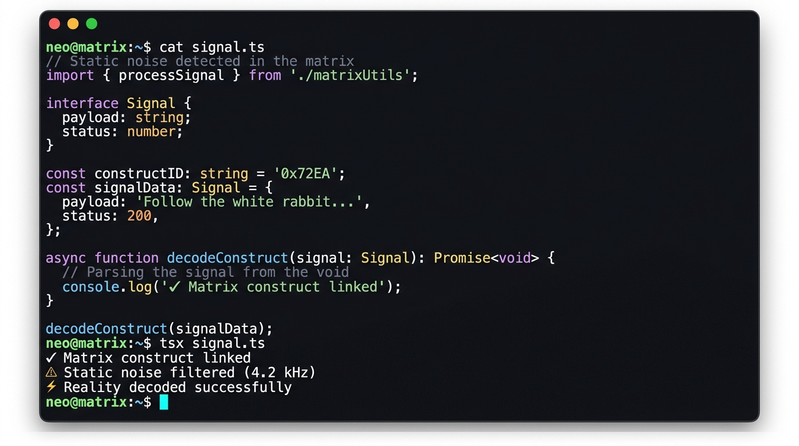

# Static Noise for Ghostty

[Static Noise](https://github.com/hcastillaq/static-noise) visual style adapter for the [Ghostty](https://ghostty.org) terminal emulator.



Static Noise is a dark chromatic visual identity designed for developer tools, featuring deep surfaces, high-contrast text, and an electric cyan focus cursor. This adapter translates those semantic color tokens into an official Ghostty theme.

## Requirements

- [Ghostty](https://ghostty.org) `1.3.0` or newer.

## Installation

### 1. Download the theme

Run the following command in your terminal to download the latest release directly into your Ghostty themes directory:

```bash
mkdir -p ~/.config/ghostty/themes
curl -fsSL -o ~/.config/ghostty/themes/static-noise \
  https://github.com/hcastillaq/static-noise.ghostty/releases/latest/download/static-noise
```

### 2. Configure Ghostty

Add the theme to your Ghostty configuration file (`~/.config/ghostty/config`):

```ini
theme = static-noise
```

### 3. Reload

Reload Ghostty (`Cmd+Shift+,` on macOS or restart the terminal) to apply the new theme.

## Visual Identity

Static Noise avoids absolute blacks and builds visual hierarchy across five principles:

- **Canvas & Surfaces:** Deep neutral void (`#0F1117`) preventing pure black fatigue.
- **Electric Focus:** Active attention cursor and focus accents (`#72EAD5`).
- **Warm Hierarchy:** Warm whites and soft slate tones for comfortable, prolonged reading.
- **Stable Semantics:** ANSI colors mapped directly to intentional functional roles (strings, keywords, functions, warnings, errors).
- **Extended Palette:** Full 256-color space derived dynamically by Ghostty (`palette-generate = true`) to harmonize with the core palette.

For more details on the design system and tokens, visit the [Static Noise specification](https://github.com/hcastillaq/static-noise).

## Development

Build the theme into `dist/static-noise`:

```bash
npm run generate
```

Run the unit test suite:

```bash
npm test
```

Validate syntax with Ghostty (optional, if `ghostty` is installed locally):

```bash
npm run validate:ghostty
```

## Updating Static Noise

The source of truth for upstream palette releases is `static-noise.lock.json`. Updates are strictly manual; no command will rewrite your lock.

## License

[MIT](LICENSE) © Hernan Castilla
